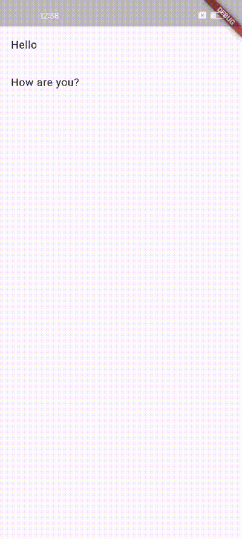
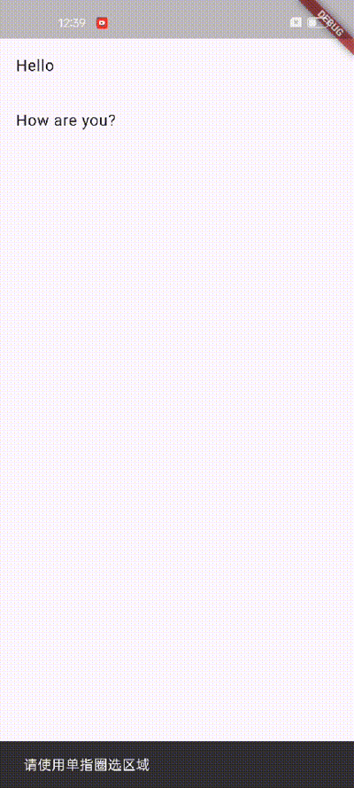
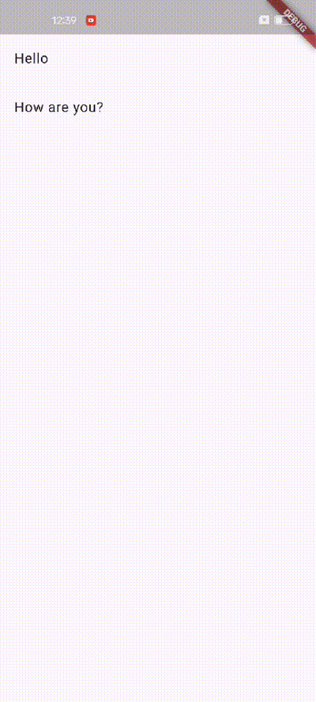
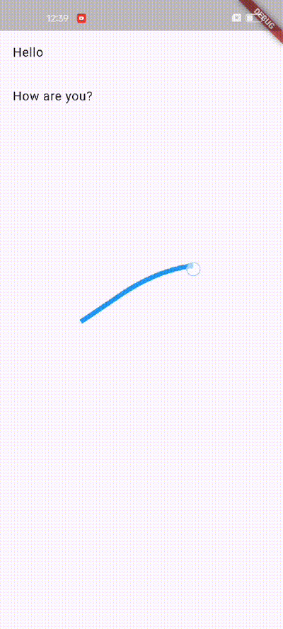

### Flutter OneDollar HandTrace
**Flutter OneDollar HandTrace** 是一个用于手势轨迹识别的 Flutter 包，基于 $1 Unistroke Recognizer 算法。这个包允许在 Flutter 应用中轻松集成手势识别功能<br/>

a. 实时手势轨迹绘制<br/>
b. 基于 $1 Unistroke Recognizer 算法的手势识别<br/>
c. 自定义识别结果展示（弹出窗口和提示栏）<br/>
d. 支持单指绘制和双指缩放<br/>
e. 可扩展的模板系统，支持添加自定义手势<br/>

<table>
  <tr>
    <td></td>
    <td></td>
    <td></td>
    <td></td>
  </tr>
</table>

### 安装和使用方法

将以下行添加到您的 pubspec.yaml 文件中：

```yaml
dependencies:
  flutter_onedollar_handtrace: ^0.1.2
```

然后运行：

```
flutter pub get
```

导入包：

```dart
import 'package:flutter_onedollar_handtrace/flutter_onedollar_handtrace.dart';
```

创建一个 GestureService 实例：

```dart
final gestureService = GestureService(
  context: context,
  callback: (name, score) {
    print('Recognized gesture: $name with score: $score');
  },
  drawingView: DrawingView(key: GlobalKey<DrawingViewState>()),
);
```

在您的 widget 树中使用 GestureService：

```dart
@override
Widget build(BuildContext context) {
  return Scaffold(
    body: gestureService.buildGestureDetector(context),
  );
}
```
### 功能扩展

#### a. 自定义绘制样式

```dart
DrawingView(
  key: GlobalKey<DrawingViewState>(),
  lineColor: Colors.blue,
  strokeWidth: 2.0,
)
```

#### b. 自定义识别结果的展示方式

```dart
GestureService(
  // ...
  popupBuilder: (context, name, score) {
    // 自定义弹出窗口逻辑
  },
  snackbarBuilder: (context, message) {
    // 自定义提示栏逻辑
  },
)
```

#### c. 向识别器添加自定义手势模板

```dart
final recognizer = TrajectoryRecognizer();
recognizer.addTemplate(Template('自定义手势', [Point(0, 0), Point(1, 1), ...]));
```
